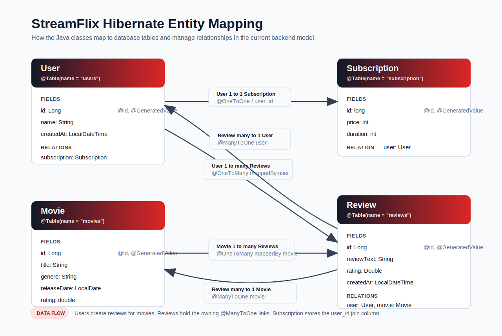

# StreamFlix Hibernate

<p align="center">
  A Netflix-inspired Java backend project for learning Hibernate ORM with PostgreSQL.
</p>

<p align="center">
  <a href="https://github.com/shiv10000/StreamFlix-Hibernate">Repository</a>
  ·
  <a href="https://github.com/shiv10000/StreamFlix-Hibernate/issues">Report an issue</a>
</p>

## Overview

StreamFlix Hibernate is a small backend learning project that models a streaming platform domain with Java, Hibernate ORM, Maven, and PostgreSQL. It focuses on practical Hibernate concepts such as annotated entities, relationships, sessions, transactions, and simple queries.

The current domain includes users, movies, reviews, and subscriptions. The application is designed as a command-line/IDE-run project rather than a web application.



## Features

- Hibernate ORM setup with PostgreSQL
- Annotated JPA entities for a streaming-style domain
- Entity relationships:
  - `User` to `Subscription`
  - `User` to `Review`
  - `Movie` to `Review`
- Transaction examples using `SessionFactory#inTransaction`
- Example inserts and queries from the application entry point
- Environment-specific database configuration through `hibernate.properties`

## Tech Stack

| Tool | Purpose |
| --- | --- |
| Java 25 | Application runtime and language |
| Maven | Dependency management and build tooling |
| Hibernate ORM 7 | Object-relational mapping |
| PostgreSQL | Relational database |
| JDBC PostgreSQL Driver | Database connectivity |

## File Structure

```text
hibernate-netflix-clone/
├── pom.xml
├── README.md
└── src/
    └── main/
        ├── java/
        │   └── org/
        │       └── example/
        │           ├── HibernateUtil.java
        │           ├── Main.java
        │           ├── Movie.java
        │           ├── Review.java
        │           ├── Subscription.java
        │           └── User.java
        └── resources/
            ├── hibernate.properties
            └── hibernate.properties.example
```

## Getting Started

### Prerequisites

- JDK 25 or compatible
- Maven
- PostgreSQL running locally or remotely

### Configure the database

Create a PostgreSQL database, then copy the example configuration:

```bash
cp src/main/resources/hibernate.properties.example src/main/resources/hibernate.properties
```

Update `src/main/resources/hibernate.properties` with your database name, username, and password:

```properties
hibernate.connection.url=jdbc:postgresql://localhost:5432/your_database
hibernate.connection.username=your_username
hibernate.connection.password=your_password
```

### Build the project

```bash
mvn compile
```

### Run the project

Run `org.example.Main` from your IDE, or configure the Maven Exec Plugin if you prefer running from the command line.

## Useful Commands

| Command | Description |
| --- | --- |
| `mvn compile` | Compiles the Java source files and downloads dependencies |
| `mvn test` | Runs tests when test coverage is added |
| `mvn package` | Builds the project artifact in `target/` |

## Project Notes

- `HibernateUtil.java` creates the shared `SessionFactory`.
- `Main.java` contains sample transaction and query flows.
- `Movie.java`, `User.java`, `Review.java`, and `Subscription.java` define the persistence model.
- `hibernate.properties.example` documents the expected database configuration.

## Roadmap

- [ ] Add more query examples
- [ ] Add seed data helpers
- [ ] Add tests for entity mappings
- [ ] Add a Maven Exec Plugin run command
- [ ] Expand relationship examples for watch history and playlists

## Author

Created by [Shivam](https://github.com/shiv10000).
